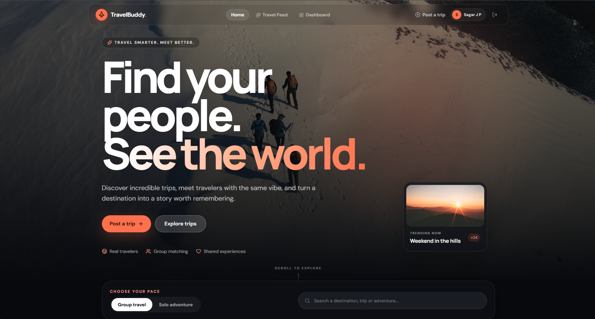
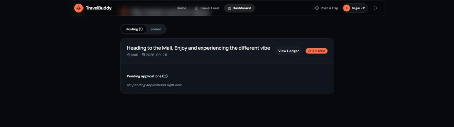
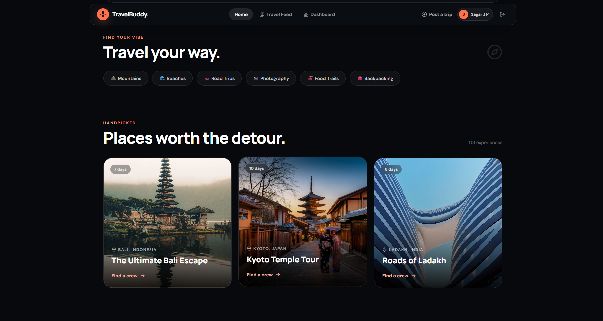
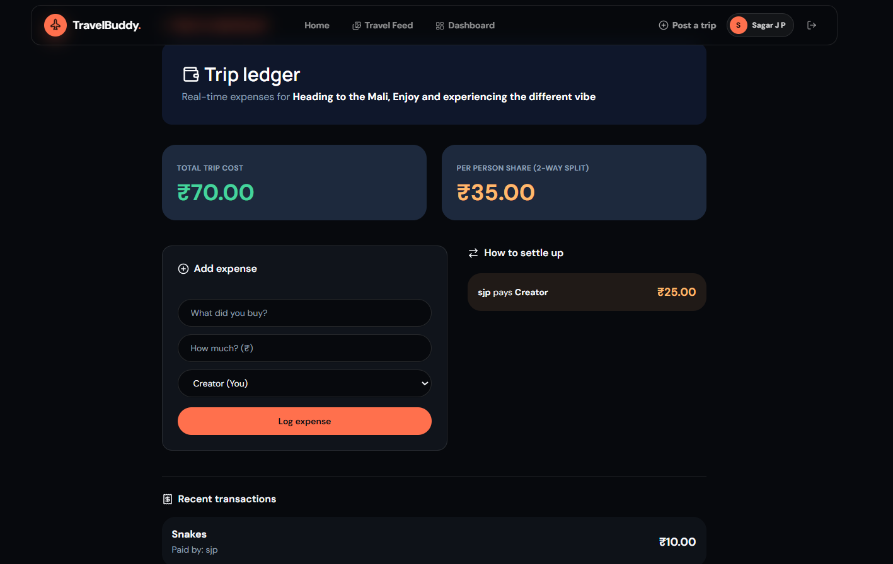

<div align="center">

# ✈️ TravelBuddy

**Find your people. Plan the journey. Share the memories.**

A full-stack MERN app for discovering trips, matching with compatible travel companions, planning together in real time, and settling shared expenses fairly — all in one place.

[**🚀 Live Demo**](https://travel-companion-finder-frontend.onrender.com/) · [Features](#-features) · [Tech Stack](#-tech-stack) · [Getting Started](#-getting-started) · [API](#-api-reference)

</div>

---

## Why TravelBuddy

Planning a group trip usually means five different apps: one to find people, one to chat, one to split bills, one to book, one to share photos afterward. TravelBuddy folds all of it into one flow — with a real compatibility-matching algorithm behind who you're paired with, not just a swipe feed.

> 🔗 **Try it live:** https://travel-companion-finder-frontend.onrender.com/
> *(Hosted on Render's free tier — the backend may take ~30–50s to wake up on first load.)*

---

## ✨ Features

<table>
<tr>
<td width="50%" valign="top">

### 🔐 Accounts & Security
- JWT auth with `bcryptjs` password hashing
- Every protected action derives identity from the verified token — never from client-submitted IDs
- CORS locked to known origins; uploaded photos stripped of EXIF/GPS metadata

### 🧳 Trips
- Create, browse, and apply to join trips; creators approve or reject applicants
- Status (**Upcoming / Ongoing / Completed**) auto-derives from trip dates on every read — never stale
- Dashboard splits hosted vs. joined trips with pending-applicant management

### 🤝 Companion Matching
- Weighted score: **travel style (35%)** + **destination overlap (35%)** + **shared interests (30%)**, using Jaccard similarity
- Every match shows *why* it scored that way, not just a number
- Editable travel profile (style, interests, wishlist) powers your own matches

</td>
<td width="50%" valign="top">

### 💬 Real-Time Collaboration
- Trip-specific chat over authenticated, membership-verified Socket.io rooms
- Shared expense ledger syncs live across every device on the trip; costs split evenly across all trip members
- **Settlement Minimization Engine** — computes the fewest possible payments to settle group balances

### ⭐ Reviews & Reputation
- Post-trip reviews unlock only after server-verified completion
- Real aggregated ratings — no placeholder data

### 📸 Travel Memories
- Cloudinary-backed photo feed, Instagram-style grid, optionally linked to a trip

### 🎫 Explore & Book (Demo)
- Three destinations with curated stays, cuisine, and flights
- Simulated booking generates a real downloadable **PDF boarding pass / hotel receipt** (jsPDF) — clearly labeled as a demo, no real payment

</td>
</tr>
</table>

### 🌍 Interactive Home Page
A rotating 3D globe (`react-three-fiber` + `three.js`) with clickable pins linking straight into each destination page, Framer Motion entrance animations, and a custom "sunset teal → coral" palette (oklch color space) with Fraunces/Inter typography.

---

## 📸 Screenshots

<table>
<tr>
<td width="50%">

**Home**


</td>
<td width="50%">

**Dashboard**


</td>
</tr>
<tr>
<td width="50%">

**Trip Discovery**


</td>
<td width="50%">

**Trip Ledger (Expense Settlement)**


</td>
</tr>
</table>

---

## 🛠 Tech Stack

| Layer | Technology |
|---|---|
| **Frontend** | React (Vite), React Router v6 |
| **Styling / UI** | Tailwind CSS v4, shadcn/ui, Framer Motion |
| **3D** | Three.js, React Three Fiber, drei |
| **Backend** | Node.js, Express |
| **Database** | MongoDB, Mongoose |
| **Auth** | JSON Web Tokens, bcryptjs |
| **Real-time** | Socket.io |
| **Media** | Multer, Cloudinary |
| **PDF generation** | jsPDF |
| **Deployment** | Render |

---

## 📁 Project Structure

```text
travel-companion-finder/
├── client/
│   └── src/
│       ├── api/            # shared axios instance (attaches JWT automatically)
│       ├── components/     # Navbar, 3D Globe, shadcn/ui primitives
│       ├── data/           # hardcoded destination data (stays, cuisine, flights)
│       ├── pages/          # route-level views
│       └── utils/          # PDF ticket/receipt generation
│
└── server/
    └── src/
        ├── config/         # Cloudinary setup
        ├── controllers/    # route logic per resource
        ├── middlewares/    # JWT auth middleware
        ├── models/         # Mongoose schemas
        ├── routes/         # Express routers
        └── utils/          # matchmaking + trip-status logic
```

---

## 🚀 Getting Started

### Prerequisites
- Node.js
- MongoDB (local or Atlas)
- A Cloudinary account

### Backend

```bash
cd server
npm install
```

Create `server/.env`:

```env
PORT=5000
MONGO_URI=mongodb://127.0.0.1:27017/travelbuddy
JWT_SECRET=your_long_random_secret_string
CLOUDINARY_CLOUD_NAME=your_cloud_name
CLOUDINARY_API_KEY=your_api_key
CLOUDINARY_API_SECRET=your_api_secret
CLIENT_URL=http://localhost:5173
```

```bash
npm run dev
```

### Frontend

```bash
cd client
npm install
```

Create `client/.env`:

```env
VITE_API_BASE_URL=http://localhost:5000
```

```bash
npm run dev
```

> If deploying (e.g. to Render), these environment variables must also be set in your hosting provider's dashboard — a local `.env` file never reaches a deployed server on its own.

---

## 📡 API Reference

🔒 = requires `Authorization: Bearer <token>`

<details>
<summary><strong>Auth</strong> — <code>/api/auth</code></summary>

| Method | Endpoint |
|---|---|
| POST | `/register` |
| POST | `/login` |

</details>

<details>
<summary><strong>Trips</strong> — <code>/api/trips</code></summary>

| Method | Endpoint | |
|---|---|---|
| GET | `/` | |
| GET | `/:id` | |
| GET | `/user/:userId` | |
| POST | `/` | 🔒 |
| POST | `/:id/apply` | 🔒 |
| PUT | `/:id/status` | 🔒 (creator only) |
| PUT | `/:id/cancel` | 🔒 (creator only) |
| DELETE | `/:id` | 🔒 (creator only) |

</details>

<details>
<summary><strong>Matches</strong> — <code>/api/matches</code></summary>

| Method | Endpoint | |
|---|---|---|
| GET | `/` | 🔒 (matches for the logged-in user) |

</details>

<details>
<summary><strong>Reviews</strong> — <code>/api/reviews</code></summary>

| Method | Endpoint | |
|---|---|---|
| GET | `/user/:userId` | |
| POST | `/` | 🔒 |
| GET | `/trip/:tripId` | 🔒 |

</details>

<details>
<summary><strong>Posts (travel feed)</strong> — <code>/api/posts</code></summary>

| Method | Endpoint | |
|---|---|---|
| GET | `/` | 🔒 |
| GET | `/user/:userId` | 🔒 |
| GET | `/trip/:tripId` | 🔒 |
| POST | `/` | 🔒 |
| DELETE | `/:id` | 🔒 |

</details>

<details>
<summary><strong>Expenses</strong> — <code>/api/expenses</code></summary>

| Method | Endpoint | |
|---|---|---|
| GET | `/:tripId` | 🔒 (trip members only) |
| POST | `/` | 🔒 (trip members only) |

</details>

<details>
<summary><strong>Users</strong> — <code>/api/users</code></summary>

| Method | Endpoint | |
|---|---|---|
| GET | `/:id` | |
| PUT | `/me` | 🔒 |

</details>

---

## 🔒 Security Notes

- Passwords always hashed (`bcryptjs`) — never stored in plain text
- Every identity-sensitive action derives the acting user from the verified JWT, never client-supplied data
- Expense and chat access both check real trip membership server-side
- Uploaded images stripped of EXIF/GPS metadata before storage
- CORS restricted to a known allowlist of frontend origins

---

## 🗺 Roadmap

- [ ] Live notifications (applications, approvals, new messages)
- [ ] Persisted chat history (currently live-only via Socket.io)
- [ ] Advanced trip search/filtering
- [ ] Real payment integration for booking (currently a labeled demo)

---

## 👤 Author

**Sagar** — built as a full-stack MERN project.
