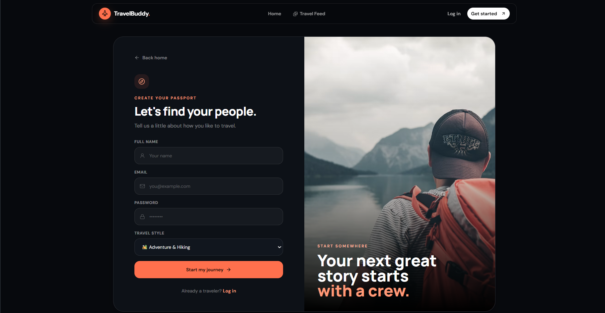
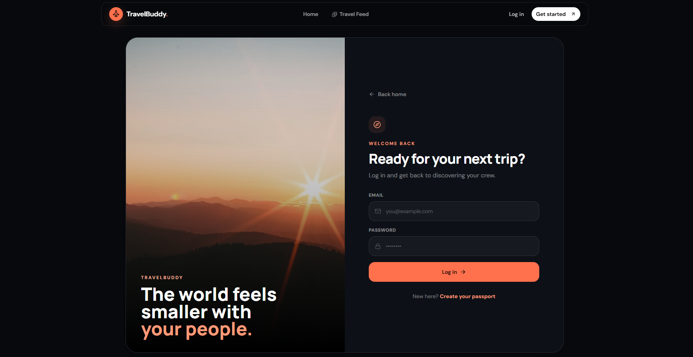
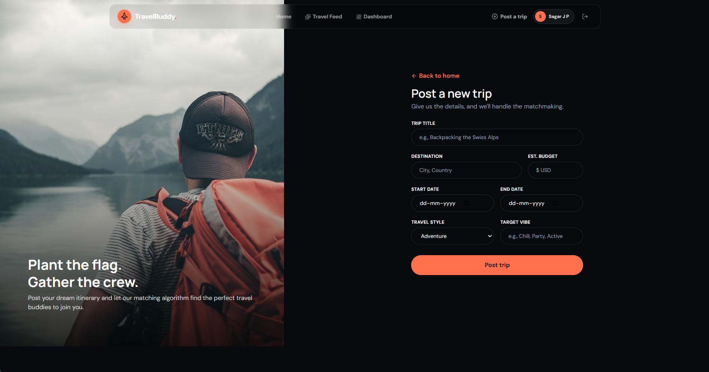
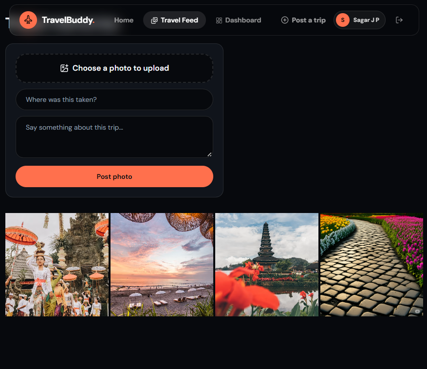

# ✈️ TravelBuddy

### Find your people. Plan the journey. Share the memories.

TravelBuddy is a full-stack MERN web application designed to help travelers discover trips, find travel companions, collaborate with their travel groups, communicate in real time, share travel memories, and manage shared travel expenses.

The project combines authentication, trip management, companion discovery, real-time communication, cloud image storage, and an automated expense settlement system into one platform.

---

## 🌐 Live Demo

🚀 **Live Application:**  
https://travel-companion-finder-frontend.onrender.com

> The application is deployed and can be accessed directly from the browser.

---

## 📸 Application Screenshots

### 🏠 Home Page


### 🔐 Register



### 🔑 Login



### 📊 Dashboard


### 🗺️ Trip Details


### ➕ Create / Post Trip



### 📸 Travel Memories Feed



### 💰 Expense Tracker


---

## 📖 About TravelBuddy

TravelBuddy is designed for travelers who want to find suitable travel companions and organize their journeys in one place.

Users can:

- Create and discover travel trips
- Apply to join trips
- Manage trip applicants
- Approve or reject applicants
- Communicate with verified trip members
- Share travel photos and memories
- Track shared travel expenses
- Calculate individual balances
- Minimize the number of financial settlements
- View trips they are hosting or joining

The overall idea can be represented as:

**Discover → Connect → Plan → Travel → Share**

---

# 🌟 Core Features

## 🔐 1. JWT-Secured Authentication

TravelBuddy uses JSON Web Tokens (JWT) for authentication.

### Features

- User registration
- User login
- Password hashing using `bcryptjs`
- JWT token generation
- Protected API routes
- Server-side authentication middleware
- User identity verification

Protected routes verify the JWT on the server instead of trusting user information sent directly from the frontend.

---

## 👥 2. Trip & Travel Companion Management

Users can create trips and find people interested in joining them.

### Trip Features

- Create a new trip
- Browse available trips
- View complete trip details
- Apply to join a trip
- Manage trip applicants
- Approve applicants
- Reject applicants
- View trips hosted by the user
- View trips joined by the user

The system separates creator and participant permissions so that only the trip creator can manage applications.

---

## 💼 3. Creator Dashboard

The dashboard provides different views depending on the user's relationship with a trip.

### Trips You Are Hosting

Trip creators can:

- View their hosted trips
- Review incoming applications
- Approve applicants
- Reject applicants
- Manage their trip

### Trips You Are Joining

Users can:

- View trips they have joined
- Access trip information
- Access shared trip functionality

This provides a centralized place for managing travel activities.

---

## 💬 4. Real-Time Logistics Chat

TravelBuddy includes real-time communication using Socket.io.

Verified trip members can communicate through trip-specific chat rooms.

### Features

- Real-time messaging
- Trip-based chat rooms
- Socket.io communication
- Restricted access for verified trip members
- Useful for coordinating travel logistics

The chat system is designed so that users outside the approved trip crew cannot freely access the trip conversation.

---

## 📸 5. Travel Memories Feed

TravelBuddy provides a travel-focused image sharing system.

Users can upload travel photos and share memories.

### Features

- Upload travel photos
- Cloudinary image storage
- Responsive image feed
- Trip-specific posts
- General travel feed
- View shared travel memories

The feed uses an Instagram-style grid layout for displaying travel photos.

---

# 💰 6. Smart Expense Settlement

One of the main technical features of TravelBuddy is the **Settlement Minimization Engine**.

Instead of simply displaying individual expenses, the system calculates how much each person ultimately owes and attempts to reduce unnecessary transactions.

### Expense Flow

```text
Expenses
   ↓
Calculate Individual Shares
   ↓
Calculate Net Balances
   ↓
Identify Debtors & Creditors
   ↓
Minimize Transactions
   ↓
Generate Settlement Instructions
```

### Example

Suppose three travelers have different expenses during a trip.

Instead of requiring every person to pay every other person separately, the system calculates the final balances and produces simplified settlement instructions.

For example:

```text
Person A → Person C : ₹500
Person B → Person C : ₹300
```

This reduces unnecessary transactions and makes group expense settlement easier.

---

# 🔄 Application Flow

```text
                 ┌─────────────────┐
                 │      User       │
                 └────────┬────────┘
                          │
                          ▼
                 ┌─────────────────┐
                 │ Authentication  │
                 └────────┬────────┘
                          │
                          ▼
                 ┌─────────────────┐
                 │ Discover Trips  │
                 └────────┬────────┘
                          │
                          ▼
                 ┌─────────────────┐
                 │ Apply / Create  │
                 │      Trip       │
                 └────────┬────────┘
                          │
                          ▼
                 ┌─────────────────┐
                 │ Join / Manage   │
                 │     Crew        │
                 └────────┬────────┘
                          │
              ┌───────────┼───────────┐
              ▼           ▼           ▼
         ┌────────┐  ┌─────────┐  ┌──────────┐
         │  Chat  │  │ Memories│  │ Expenses │
         └────────┘  └─────────┘  └────┬─────┘
                                       │
                                       ▼
                              ┌─────────────────┐
                              │   Settlement    │
                              │   Minimization  │
                              └─────────────────┘
```

---

# 🛠️ Tech Stack

| Layer | Technology | Purpose |
|---|---|---|
| Frontend | React.js + Vite | User interface and SPA |
| Routing | React Router v6 | Client-side navigation |
| Backend | Node.js + Express.js | REST API and server logic |
| Database | MongoDB + Mongoose | Data storage and models |
| Authentication | JWT + bcryptjs | Authentication and password security |
| HTTP Client | Axios | Frontend API communication |
| Real-Time Communication | Socket.io | Real-time chat |
| Image Upload | Multer | Handling uploaded images |
| Image Storage | Cloudinary | Cloud-based image storage |
| Deployment | Render | Application deployment |

---

# 🏗️ Project Architecture

TravelBuddy follows a client-server architecture.

```text
                         TravelBuddy
                              │
             ┌────────────────┴────────────────┐
             │                                 │
             ▼                                 ▼
      ┌──────────────┐                  ┌──────────────┐
      │   Frontend   │                  │   Backend    │
      │ React + Vite │                  │ Node + Express│
      └──────┬───────┘                  └──────┬───────┘
             │                                 │
             │ Axios                           │
             └───────────────┬─────────────────┘
                             │
                             ▼
                      ┌──────────────┐
                      │   MongoDB    │
                      └──────────────┘
                             │
                             │
              ┌──────────────┴──────────────┐
              ▼                             ▼
       ┌──────────────┐              ┌──────────────┐
       │  Cloudinary  │              │   Socket.io  │
       │ Image Storage│              │ Real-time Chat│
       └──────────────┘              └──────────────┘
```

---

# 📂 Project Structure

```text
TravelBuddy/
│
├── client/
│   ├── public/
│   │
│   ├── src/
│   │   ├── api/
│   │   │   └── axiosInstance.js
│   │   │
│   │   ├── components/
│   │   │
│   │   ├── pages/
│   │   │
│   │   ├── App.jsx
│   │   └── main.jsx
│   │
│   ├── package.json
│   └── ...
│
├── server/
│   ├── config/
│   │   └── cloudinary.js
│   │
│   ├── controllers/
│   │
│   ├── middleware/
│   │   └── authMiddleware.js
│   │
│   ├── models/
│   │
│   ├── routes/
│   │
│   ├── server.js
│   └── package.json
│
├── docs/
│   └── screenshots/
│
├── README.md
├── futureWork.txt
└── Improvements for future.txt
```

---

# 🗄️ Database & Data Models

The backend uses MongoDB with Mongoose models.

The application manages data related to:

- Users
- Trips
- Trip applications
- Travel posts
- Expenses
- Trip participants

The models provide structured data validation and database interaction through Mongoose.

---

# 🔌 API Documentation

## Authentication

| Method | Endpoint | Authentication |
|---|---|---|
| POST | `/api/auth/register` | Public |
| POST | `/api/auth/login` | Public |

---

## Trips

| Method | Endpoint | Authentication |
|---|---|---|
| GET | `/api/trips` | Public |
| GET | `/api/trips/:id` | Public |
| GET | `/api/trips/user/:userId` | Public |
| POST | `/api/trips` | 🔒 Required |
| POST | `/api/trips/:id/apply` | 🔒 Required |
| PUT | `/api/trips/:id/status` | 🔒 Required |
| DELETE | `/api/trips/:id` | 🔒 Required |

---

## Posts

| Method | Endpoint | Authentication |
|---|---|---|
| GET | `/api/posts` | Public |
| GET | `/api/posts/user/:userId` | Public |
| GET | `/api/posts/trip/:tripId` | Public |
| POST | `/api/posts` | 🔒 Required |
| DELETE | `/api/posts/:id` | 🔒 Required |

---

## Expenses

| Method | Endpoint | Authentication |
|---|---|---|
| GET | `/api/expenses/:tripId` | 🔒 Required |
| POST | `/api/expenses` | 🔒 Required |

---

## Users

| Method | Endpoint | Authentication |
|---|---|---|
| GET | `/api/users/:id` | Public |

---

# 🔒 Security

TravelBuddy includes several security-related mechanisms.

### Authentication

JWT tokens are used to authenticate users and protect private routes.

### Password Protection

Passwords are hashed using `bcryptjs` instead of storing plain-text passwords.

### Protected Routes

Authentication middleware verifies the user's JWT before allowing access to protected API endpoints.

### Authorization

Trip-related actions use the authenticated user identity to control access to creator-only operations.

### Environment Variables

Sensitive credentials such as:

- MongoDB connection strings
- JWT secret
- Cloudinary API credentials

are stored in environment variables instead of being hard-coded into the source code.

---

# ⚙️ Technical Highlights

## JWT Authentication

```text
User Login
    ↓
Credentials Verified
    ↓
JWT Generated
    ↓
Token Sent to Client
    ↓
Token Attached to Requests
    ↓
Server Middleware Verifies Token
    ↓
Protected Resource Access
```

---

## Real-Time Communication

Socket.io provides bidirectional communication between users and the server.

```text
User A
   │
   │ Message
   ▼
Socket.io Server
   │
   │ Broadcast
   ▼
User B
```

This allows trip members to communicate without continuously refreshing the page.

---

## Cloud Image Storage

Images uploaded by users are handled using Multer and stored using Cloudinary.

```text
User
  ↓
Image Upload
  ↓
Multer
  ↓
Backend
  ↓
Cloudinary
  ↓
Image URL
  ↓
MongoDB / Application
```

---

# 🚀 Installation & Setup

## Prerequisites

Before running the project locally, install:

- Node.js
- MongoDB Community Server or MongoDB Atlas
- Cloudinary account
- Git

---

# 📥 Clone the Repository

```bash
git clone <YOUR_REPOSITORY_URL>
cd travel-companion-finder
```

---

# 🔧 Backend Setup

Navigate to the server folder:

```bash
cd server
```

Install dependencies:

```bash
npm install
```

Create a `.env` file inside the `server` directory.

```env
PORT=5000

MONGO_URI=mongodb://127.0.0.1:27017/travelbuddy

JWT_SECRET=your_long_random_secret_string

CLOUDINARY_CLOUD_NAME=your_cloud_name
CLOUDINARY_API_KEY=your_api_key
CLOUDINARY_API_SECRET=your_api_secret

CLIENT_URL=http://localhost:5173
```

Start the backend:

```bash
npm run dev
```

The backend should run on:

```text
http://localhost:5000
```

---

# 🎨 Frontend Setup

Open another terminal and navigate to the client directory:

```bash
cd client
```

Install dependencies:

```bash
npm install
```

Create a `.env` file inside the `client` directory:

```env
VITE_API_BASE_URL=http://localhost:5000
```

Start the frontend:

```bash
npm run dev
```

The frontend should run on:

```text
http://localhost:5173
```

---

# 🌍 Environment Variables

## Backend

| Variable | Description |
|---|---|
| `PORT` | Backend server port |
| `MONGO_URI` | MongoDB connection string |
| `JWT_SECRET` | Secret used for JWT signing |
| `CLOUDINARY_CLOUD_NAME` | Cloudinary cloud name |
| `CLOUDINARY_API_KEY` | Cloudinary API key |
| `CLOUDINARY_API_SECRET` | Cloudinary API secret |
| `CLIENT_URL` | Frontend URL |

## Frontend

| Variable | Description |
|---|---|
| `VITE_API_BASE_URL` | Backend API base URL |

> Never commit real API keys, database credentials, JWT secrets, or Cloudinary secrets to GitHub.

---

# ▶️ Running the Project

Start the backend:

```bash
cd server
npm run dev
```

Start the frontend in another terminal:

```bash
cd client
npm run dev
```

Then open the frontend URL shown by Vite in your browser.

---

# 🖥️ Interface Highlights

TravelBuddy contains multiple interfaces designed around different parts of the travel workflow.

### Home

Provides an entry point for discovering the application and available travel opportunities.

### Authentication

Provides dedicated registration and login interfaces.

### Dashboard

Allows users to manage trips they host and trips they have joined.

### Trip Details

Displays information about a particular trip and its participants.

### Create Trip

Allows users to publish their own travel plans.

### Travel Feed

Provides a visual space for sharing and viewing travel memories.

### Expense Tracker

Allows trip members to manage shared expenses and view settlement information.

---

# 🧭 Typical User Journey

```text
1. Register
      ↓
2. Login
      ↓
3. Explore Trips
      ↓
4. Apply to Join OR Create a Trip
      ↓
5. Trip Creator Reviews Application
      ↓
6. Application Approved
      ↓
7. Join Trip Crew
      ↓
8. Communicate Through Chat
      ↓
9. Share Travel Memories
      ↓
10. Record Shared Expenses
      ↓
11. Calculate Final Balances
      ↓
12. Settle Expenses
```

---

# 📊 Feature Summary

| Feature | Description |
|---|---|
| Authentication | JWT-based user authentication |
| User Security | Password hashing with bcryptjs |
| Trip Management | Create, browse and manage trips |
| Applications | Apply to join trips |
| Creator Controls | Approve or reject applicants |
| Dashboard | Manage hosted and joined trips |
| Real-Time Chat | Socket.io-based trip communication |
| Travel Feed | Share and browse travel photos |
| Image Storage | Cloudinary integration |
| Expense Tracking | Record shared trip expenses |
| Settlement Engine | Minimize financial transactions |
| Responsive UI | Designed for different screen sizes |

---

# 📈 What This Project Demonstrates

This project demonstrates practical experience with:

- MERN stack development
- React component development
- REST API development
- MongoDB database design
- Mongoose models
- JWT authentication
- Password hashing
- Protected API routes
- Authorization
- File uploads
- Cloudinary integration
- Socket.io real-time communication
- Expense calculation logic
- Frontend-backend integration
- Environment variable management
- Full-stack application deployment

---

# 🧠 Key Technical Concepts Used

### Frontend

- React
- JSX
- React Router
- State management
- API integration
- Responsive UI

### Backend

- Node.js
- Express.js
- REST APIs
- Middleware
- Controllers
- Routes

### Database

- MongoDB
- Mongoose
- Schemas
- Models
- CRUD operations

### Authentication

- JWT
- bcryptjs
- Protected routes
- Authorization middleware

### Real-Time Systems

- Socket.io
- WebSocket-based communication
- Trip-specific chat rooms

### Cloud Services

- Cloudinary
- Render

---

# 🔮 Future Improvements

Possible future improvements include:

- Advanced trip search and filtering
- Location-based companion discovery
- User ratings and reviews
- Improved recommendation system
- Push notifications
- Email notifications
- Improved profile management
- More advanced expense analytics
- Mobile application
- Additional trip planning tools
- Improved real-time collaboration features

---

# 📌 Current Project Status

TravelBuddy is a functional full-stack MERN project with:

- User authentication
- Trip creation and discovery
- Trip application management
- Creator dashboard
- Real-time trip chat
- Travel memories feed
- Cloudinary image storage
- Shared expense tracking
- Settlement minimization
- Frontend and backend deployment

The project is suitable as a practical demonstration of full-stack web development and integration of multiple modern web technologies.

---

# 💡 Why TravelBuddy?

TravelBuddy brings several travel-related activities into one application.

Instead of using separate platforms for:

- Finding travel companions
- Planning trips
- Communicating with the group
- Sharing travel memories
- Tracking shared expenses

TravelBuddy combines these workflows into a single full-stack application.

---

# 👨‍💻 Author

**Sagar**

Built as a full-stack web development project using the MERN stack.

---

# 📄 License

This project does not currently specify a license.

If you plan to make the repository fully open source, consider adding an appropriate license file such as the MIT License.

---

# ⭐ Project Highlights

- Full-stack MERN architecture
- JWT-secured authentication
- Role-based trip management
- Real-time communication with Socket.io
- Cloudinary image integration
- Automated expense settlement
- RESTful API architecture
- MongoDB database
- Deployed web application

---

## ✈️ TravelBuddy

**Find your people. Plan the journey. Share the memories.**
